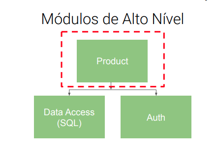
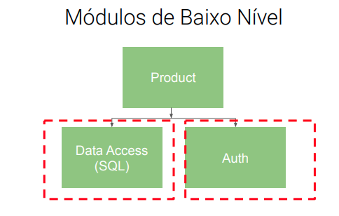
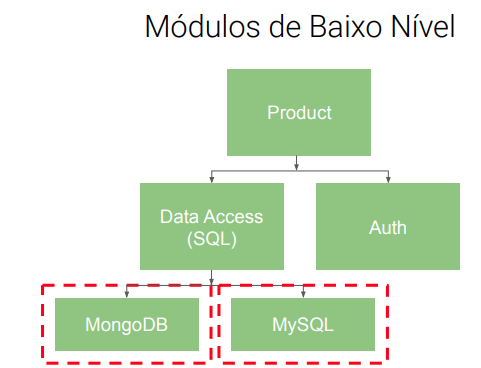

# [D] - Dependency Inversion Principle
## Princípio da Inversão de Dependência DIP

“Módulos de alto nível não devem depender de módulos
de baixo nível. Ambos devem depender de abstrações;
Abstrações não devem depender de detalhes.”

### **Módulos de Alto Nível**

### **Módulos de Baixo Nível**

### **Módulos de Baixo Nível**
